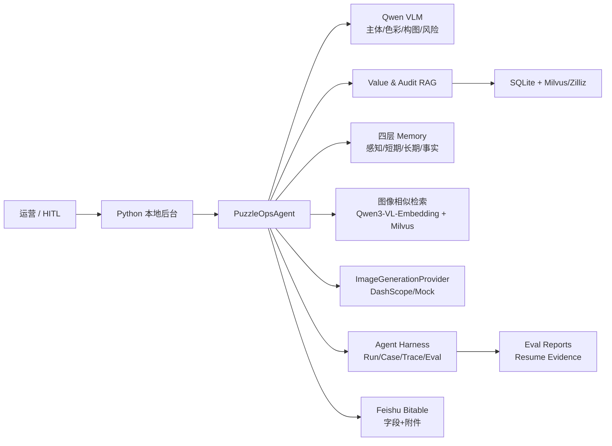
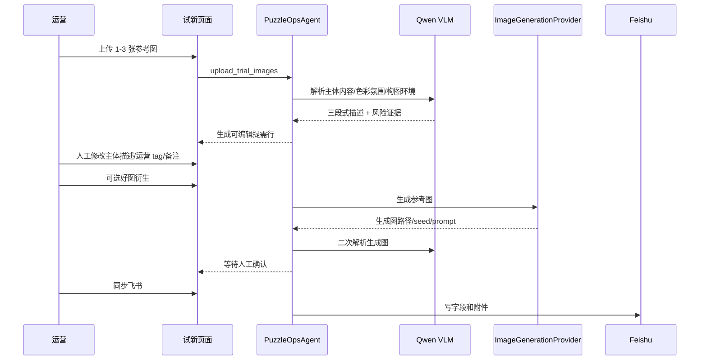
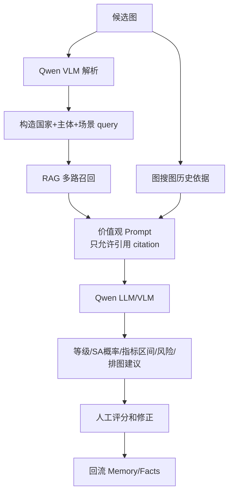
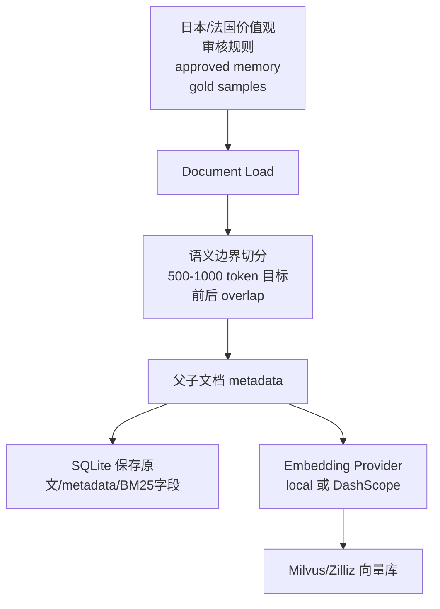
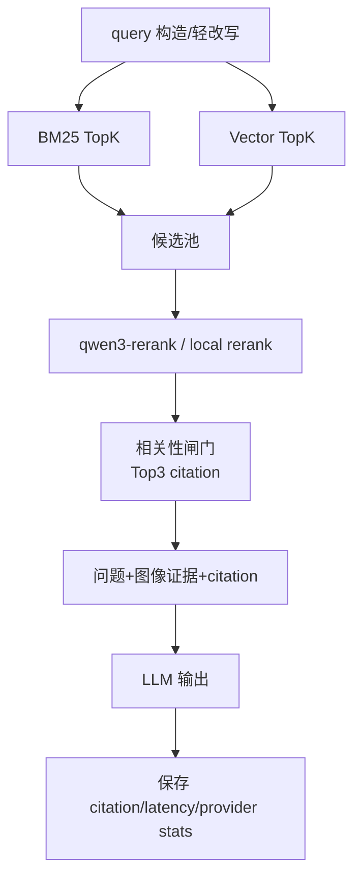
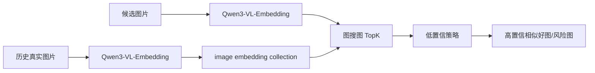

# PuzzleOps Agent Architecture

## 1. 总体定位

PuzzleOps Agent 是面向拼图内容运营的 Agent Harness 系统。它把图片理解、价值观 RAG、审核规则、历史依据、人工反馈、飞书同步和评测报告放在同一个工程闭环里。

## 2. 运行层

当前本地页面入口是 Python 标准库 `ThreadingHTTPServer`：

- `run_app.py` 调用 `puzzle_ops.server.run()`。
- `puzzle_ops/server.py` 负责 HTTP route、表单提交、文件上传。
- `puzzle_ops/renderer.py` 生成 HTML。
- `puzzle_ops/agents.py` 承接业务编排。

这个设计适合单机快速 demo 和本地面试演示。6 人团队共用时，v0.7.60 已在现有 Agent 层外增加 FastAPI service layer，详见 [API_SPEC.md](API_SPEC.md)。

## 3. 试新提需链路

关键边界：

- 试新解析文案只保留“主体内容 / 色彩氛围 / 构图环境”三段，避免不符合业务标准的长备注污染提需表。
- AI 生成描述和运营 tag 均可人工编辑。
- 好图衍生只有 provider 配置、生成成功、二次审核通过、人工确认后才可进入飞书附件。

## 4. 价值观大师链路

价值观大师的输入不是单一文本，而是多源证据：

- 当前图片的 VLM 解析。
- 国家价值观与审核规则 RAG citation。
- 真实历史样本、gold label、业务指标。
- 图像相似检索返回的高置信历史好图/风险图。
- Memory 中 approved 的长期价值观和结构化事实。

## 5. RAG 离线阶段

当前实现选择：

- SQLite 保存 chunk 原文、父子关系、结构化字段、Memory 状态和审计日志。
- Milvus/Zilliz 保存向量和轻量 metadata，用于语义检索。
- BM25 由本地 Python 词面匹配实现，向量检索可走本地 fallback 或 Milvus。
- embedding/rerank 默认关闭远程调用，显式打开后使用 DashScope provider。

## 6. RAG 在线阶段

Prompt 口径：

- 只根据提供资料和当前图像证据回答。
- 资料不足时必须写“需要人工复核”。
- 输出需要带 citation id，防止把模型常识伪装成业务规则。

## 7. Memory 设计

Memory 不放在 Milvus 里作为主存储，因为 Memory 是事务型业务状态，不只是向量：

- `perception`：感知记忆，保存 VLM 观察、图片解析、临时视觉证据。
- `short_term`：短期记忆，保存当前任务状态、生成 trace、临时操作上下文。
- `long_term`：长期记忆，保存运营批准后的价值观和稳定经验。
- `fact`：结构化事实，保存国家、主体、运营 tag、图片路径、gold label、业务指标。

Memory 治理字段包括：

- `status`、`review_status`、`approved_for_rag`。
- `created_by`、`approved_by`、`retired_by`。
- `expires_at`、`fingerprint`、`source_memory_id`。
- `conflict_group_id`、`rag_hit_count`、`last_rag_hit_at`。

只有 `approved + active + approved_for_rag + 未过期 + 无冲突锁定` 的 memory 才进入 RAG。

## 8. 图像相似检索

v0.7.58 的策略是：如果历史库太小且最高相似分低于校准提示线，不强行展示 TopK，而是显示“暂无可靠历史相似图”。这样避免低质量历史依据污染价值观大师。

## 9. Harness

Harness 把每一次 Agent 判断变成可复盘样本：

- `EvalSample`：图片、国家、gold subject、gold color mood、gold composition、gold value/risk labels、真实等级和业务指标。
- `HarnessRun`：版本、数据集、模型 provider、case 数、指标、失败样本。
- `HarnessCaseResult`：输入、输出、tool calls、trace steps、scores、failure reasons、human override。

评测关注：

- 三段式描述合规率。
- 飞书字段完整率。
- RAG Hit/MRR/NDCG/Precision/Recall。
- 图像相似 Hit@5、MRR、低置信策略。
- 价值观预测等级可信度和人工评分。
- HITL 修正是否可回流。

## 10. FastAPI 服务层

v0.7.60 已实现 FastAPI runtime 第一版：

- 保留当前本地页面。
- 新增 `puzzle_ops/api.py`。
- 使用 FastAPI `TestClient` 覆盖鉴权、OpenAPI、health、rag search、value analyze、harness summary。
- 6 人团队通过 token 访问 API，后续部署到局域网服务器或云服务器。
- 飞书写入接口暂缓开放，仍由现有页面人工确认同步，避免多人误写生产表。
