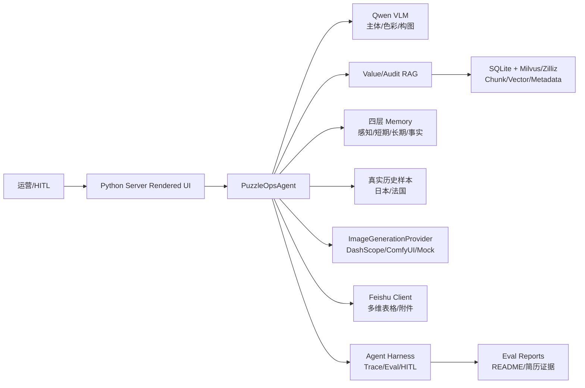
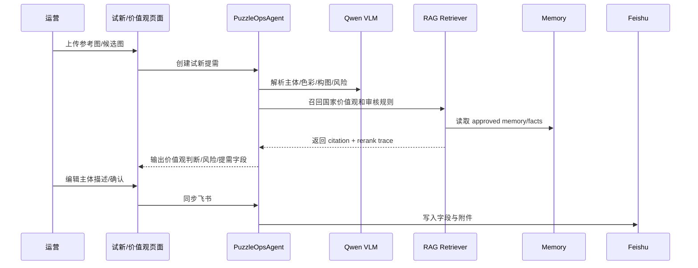
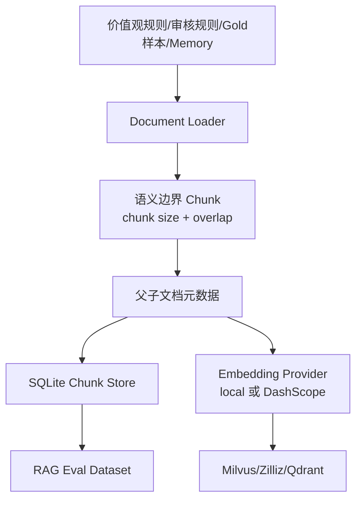
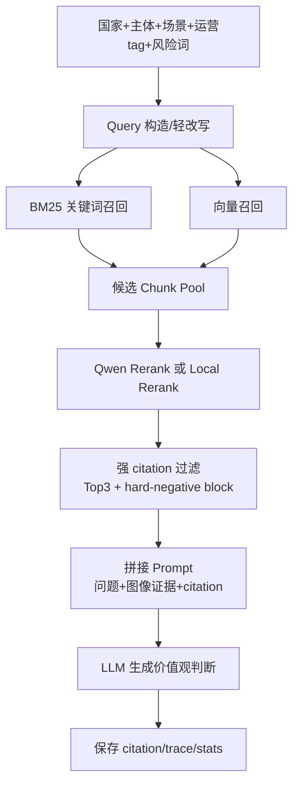
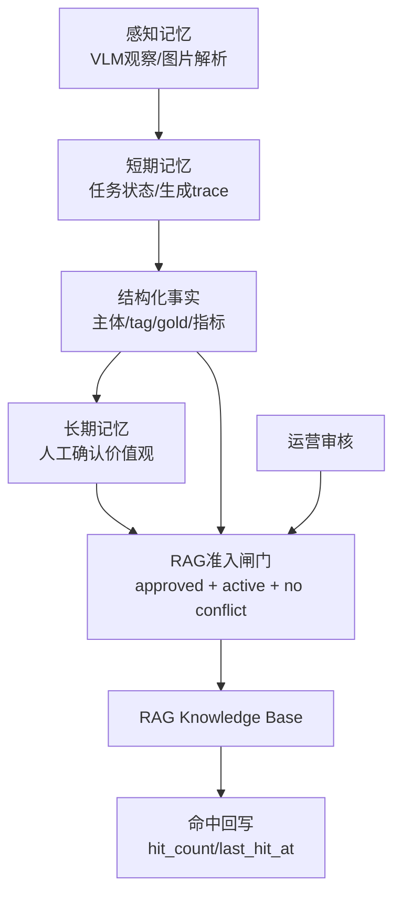
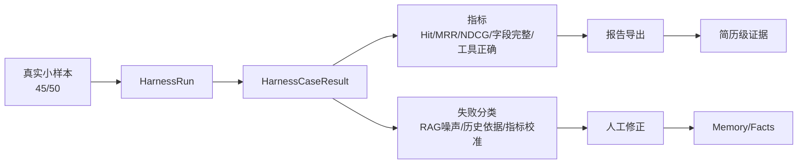
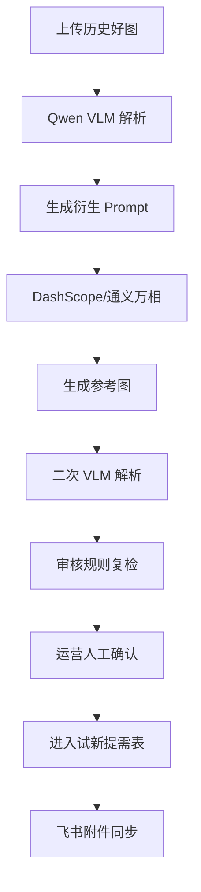

# PuzzleOps Agent 架构说明

## 总览

## Agent 主链路

## RAG 离线阶段

## RAG 在线阶段

## Memory 四层

## Harness 评测闭环

## 好图衍生链路

## 当前边界

- 主等级预测仍保留 `v0.7.39-legacy`，不因第三层 shadow 实验自动替换。
- RAG citation 已能召回 expected，但 TopK 仍存在 hard-negative 噪声。
- 历史依据 shadow rerank 只作为影子能力，不默认上线。
- 当前 45 条真实样本适合简历 demo 和小样本评测，不适合宣称大规模线上效果。

